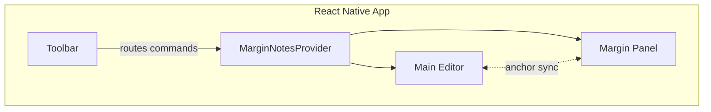
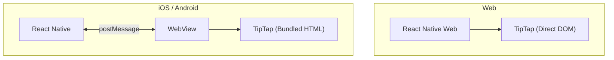
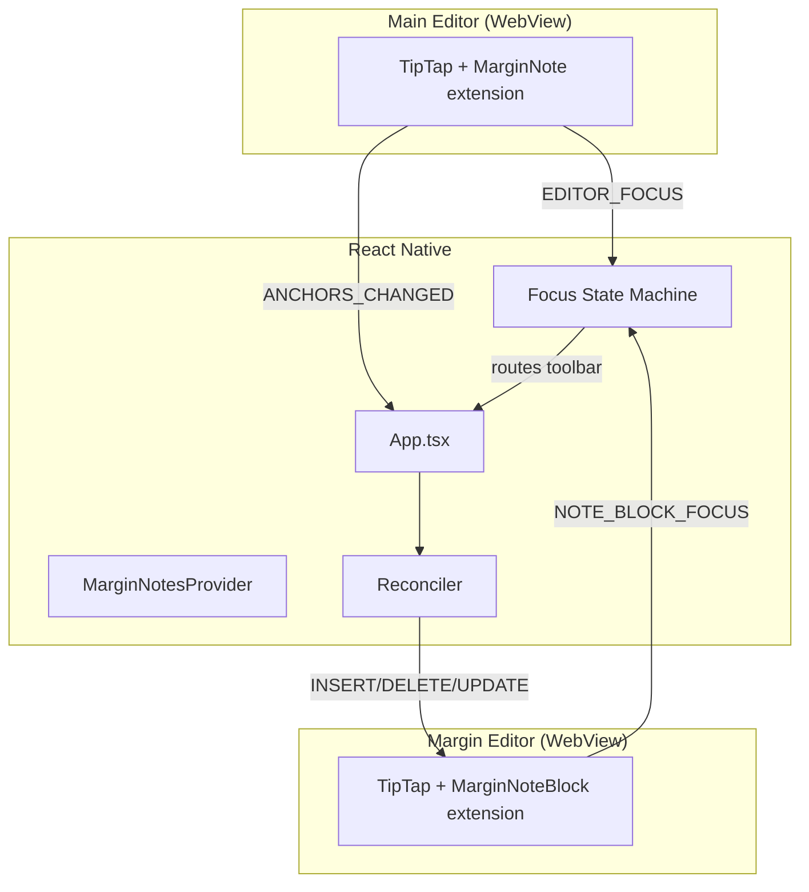
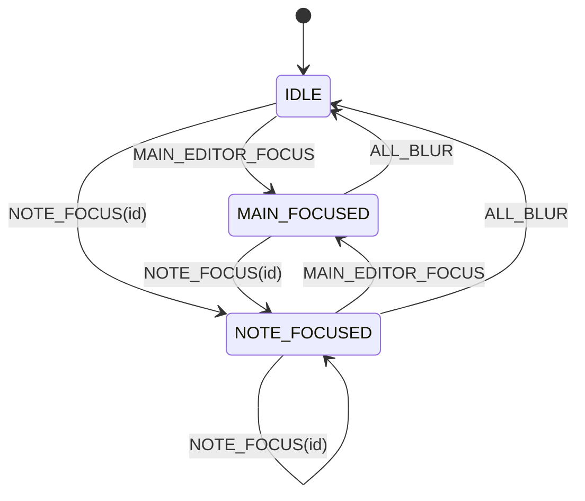
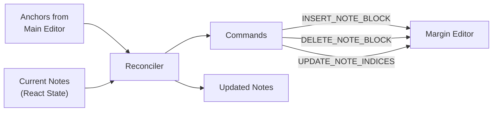
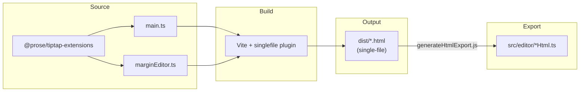

# TipTap React Native - Margin Notes Editor

A rich text editor for React Native with Tufte-style margin notes, using TipTap/ProseMirror.

Inspired by:
- LaTeX `\marginpar`
- Typst [marginalia](https://github.com/nleanba/typst-marginalia)

## Overview



Two synchronized TipTap editors:
- **Main Editor**: Document with inline margin note anchors
- **Margin Panel**: Note blocks for each anchor

---

## Platform Architecture



| Platform | Rendering | Communication |
|----------|-----------|---------------|
| Web | Direct TipTap | Function calls |
| Mobile | WebView + bundled HTML | postMessage bridge |

---

## Core Architecture



---

## Focus State Machine

Manages which editor receives toolbar commands.



| State | `focusedEditor` | Toolbar Target |
|-------|-----------------|----------------|
| IDLE | `null` | None |
| MAIN_FOCUSED | `'main'` | Main Editor |
| NOTE_FOCUSED | `{ noteId }` | Margin Editor |

---

## Reconciler

Converts main editor anchors into margin panel commands.



**Single Source of Truth:**

| State | Owner |
|-------|-------|
| Anchor existence & position | Main Editor |
| Note content | Margin Editor |
| Note list (derived) | React Native |
| Focus state | React Native |

---

## Message Protocol

Typed messages with `SCREAMING_SNAKE_CASE`.

### Main Editor → React Native
- `EDITOR_FOCUS` / `EDITOR_BLUR`
- `ANCHORS_CHANGED` - anchor positions updated
- `CONTENT_CHANGED` - document content
- `SELECTION_CHANGED` - formatting state

### React Native → Main Editor
- `INSERT_MARGIN_NOTE` / `DELETE_MARGIN_NOTE`
- `TOGGLE_BOLD`, `TOGGLE_ITALIC`, etc.
- `INSERT_SQUARE`, `INSERT_CIRCLE`, `INSERT_FLOWER`

### Margin Editor → React Native
- `NOTE_BLOCK_FOCUS` - specific note focused
- `DELETE_MARGIN_NOTE` - empty note badge clicked

### React Native → Margin Editor
- `INSERT_NOTE_BLOCK` / `DELETE_NOTE_BLOCK`
- `UPDATE_NOTE_INDICES` - reorder notes
- `FOCUS_NOTE_BLOCK`
- Format commands (same as main)

---

## Build Pipeline



---

## Project Structure

```
├── App.tsx                      # Main app, toolbar, reconciler
├── src/
│   ├── editor/
│   │   ├── TipTapEditor.tsx     # Mobile WebView wrapper
│   │   ├── TipTapEditor.web.tsx # Web direct TipTap
│   │   ├── MarginEditor.tsx     # Mobile margin WebView
│   │   ├── MarginEditor.web.tsx # Web margin TipTap
│   │   ├── editorHtml.ts        # Bundled main editor
│   │   └── marginEditorHtml.ts  # Bundled margin editor
│   ├── margin-notes/
│   │   ├── FocusStateMachine.ts # Focus reducer & types
│   │   ├── MarginNoteReconciler.ts
│   │   └── MarginNotesContext.tsx
│   └── components/
│       └── MarginNotesPanel.tsx
├── editor-web/                  # WebView bundle source
│   ├── src/
│   │   ├── main.ts
│   │   ├── marginEditor.ts
│   │   └── protocol/           # Shared message types
│   └── vite.config.ts
└── packages/
    └── tiptap-extensions/       # TipTap extensions
        └── src/extensions/
            ├── MarginNote.ts    # Inline anchor
            ├── MarginNoteBlock.ts
            └── NoteHighlight.ts
```

---

## Getting Started

```bash
# Install dependencies
npm install

# Build extensions
cd packages/tiptap-extensions && npm run build && cd ../..

# Build WebView bundles
cd editor-web && npm run build && node generateHtmlExport.js && cd ..

# Run
npx expo start     # Dev server
npm run web        # Web browser
npm run ios        # iOS simulator
npm run android    # Android emulator
```

---

## Key Design Decisions

| Decision | Rationale |
|----------|-----------|
| WebView for TipTap | TipTap requires real DOM; WebView provides it on mobile |
| Single-file HTML bundle | `vite-plugin-singlefile` embeds JS/CSS for easy WebView loading |
| One margin editor WebView | Multiple WebViews = ~50MB each; single editor is more efficient |
| Focus state machine | Deterministic focus routing vs scattered conditionals |
| Reconciler pattern | Single source of truth prevents state divergence |
| Ref + State pattern | Refs for synchronous access, state for React re-renders |

---

## Testing

```bash
npx jest                    # Run all tests (75 tests)
npx jest --watch           # Watch mode
npx jest FocusStateMachine # Specific file
```

Test coverage:
- Focus state machine transitions
- Reconciler logic (add/remove/reorder)
- Context provider integration

---

## Debug Logging

All logs use prefixed format for filtering:

| Prefix | Source |
|--------|--------|
| `[MainEditor]` | Main editor WebView |
| `[MarginEditor]` | Margin editor WebView |
| `[Focus]` | Focus state machine |
| `[Reconciler]` | Reconciler operations |

---

## License

MIT
